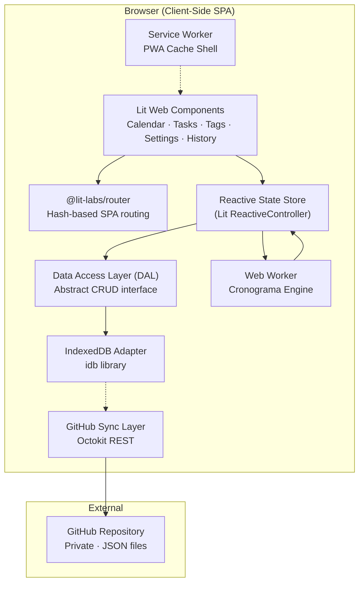
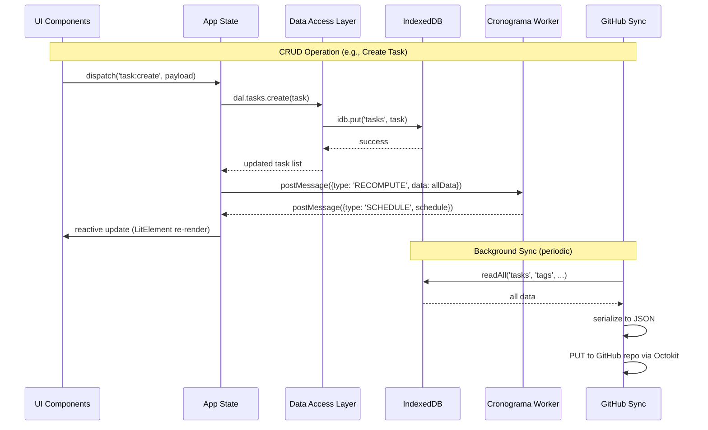
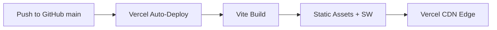

# Cronograma — Technical Implementation Specification

> **Document Purpose:** This is an agent-oriented implementation spec. Every section is written to be directly actionable by an autonomous coding agent without human clarification. All ambiguities have been resolved via stakeholder interview.

---

## 1. System Architecture & Tech Stack

### 1.1 High-Level Architecture



### 1.2 Tech Stack

| Layer | Technology | Rationale |
|-------|-----------|-----------|
| **Build** | Vite 6+ | Fast HMR, ESM-native, minimal config |
| **UI** | Lit 3+ (Web Components) | Encapsulated components, small runtime (~5KB), native platform |
| **Routing** | `@lit-labs/router` | Lightweight, Lit-native SPA routing |
| **State** | Lit `ReactiveController` + custom event bus | No external state library needed; controllers are composable |
| **Storage** | IndexedDB via `idb` library | Async, structured, large capacity, ideal for offline-first |
| **Sync** | `@octokit/rest` | Official GitHub API client |
| **Scheduler** | Dedicated Web Worker | Non-blocking computation, clean separation from UI |
| **PWA** | `vite-plugin-pwa` (Workbox) | Service worker generation, precaching, Add-to-Home-Screen |
| **IDs** | `ulid` package | Timestamp-sortable, universally unique, 26-char URL-safe |
| **i18n** | `@lit/localize` | Lit-native, compile-time extraction, JSON locale bundles |
| **Hosting** | Vercel (static deployment) | Zero-config for Vite, free tier, global CDN |
| **Repository** | GitHub (public or private) | Code hosting + data storage (JSON sync target) |

### 1.3 Project Structure

```
cronograma/
├── public/
│   ├── manifest.json            # PWA manifest
│   └── icons/                   # App icons (192x192, 512x512)
├── src/
│   ├── index.html               # SPA entry point
│   ├── main.js                  # App bootstrap, router init, SW registration
│   ├── app-shell.js             # Root <app-shell> component (layout + router outlet)
│   │
│   ├── components/              # Reusable Lit components
│   │   ├── calendar/
│   │   │   ├── calendar-view.js         # Parent: switches Day/Week/Month
│   │   │   ├── calendar-day-view.js     # Hourly grid with slots
│   │   │   ├── calendar-week-view.js    # 7-column day grid
│   │   │   ├── calendar-month-view.js   # 4-5 row week grid
│   │   │   ├── calendar-event-block.js  # Single scheduled block (task/tag)
│   │   │   └── calendar-drag-handler.js # Desktop drag-and-drop logic
│   │   ├── tasks/
│   │   │   ├── task-list-view.js        # Filterable task list
│   │   │   ├── task-form.js             # Create/Edit task modal/drawer
│   │   │   ├── task-card.js             # Summary card
│   │   │   └── task-dependency-graph.js # Visual dependency viewer
│   │   ├── tags/
│   │   │   ├── tag-list-view.js
│   │   │   ├── tag-form.js
│   │   │   └── tag-time-window-editor.js # Per-day-of-week time window config
│   │   ├── history/
│   │   │   ├── history-view.js          # Grouped-by-tag completed task list
│   │   │   └── history-stats.js         # Per-tag completion stats
│   │   ├── settings/
│   │   │   └── settings-view.js         # All settings in one view
│   │   └── shared/
│   │       ├── color-picker.js
│   │       ├── time-range-input.js
│   │       ├── alert-badge.js
│   │       ├── drawer-panel.js          # Slide-in detail drawer
│   │       ├── confirm-dialog.js
│   │       └── toast-notification.js
│   │
│   ├── engine/
│   │   ├── cronograma.worker.js         # Web Worker entry point
│   │   ├── scheduler.js                 # Core scheduling algorithm (pure functions)
│   │   ├── dependency-resolver.js       # Topological sort + cycle detection
│   │   ├── alert-evaluator.js           # Red/Orange alert computation
│   │   ├── tag-window-expander.js       # Auto-expanding tag time windows
│   │   └── slot-allocator.js            # Time slot filling logic
│   │
│   ├── data/
│   │   ├── dal.js                       # Abstract Data Access Layer interface
│   │   ├── idb-adapter.js              # IndexedDB implementation of DAL
│   │   ├── github-sync.js              # Octokit-based sync to GitHub repo
│   │   ├── schemas.js                  # JSON Schema definitions + validators
│   │   └── migrations.js              # Schema version migration logic
│   │
│   ├── state/
│   │   ├── app-state.js                # Central reactive state controller
│   │   ├── event-bus.js                # Custom event emitter for cross-component communication
│   │   └── schedule-state.js           # Computed schedule from worker
│   │
│   ├── styles/
│   │   ├── tokens.css                  # CSS custom properties (colors, spacing, typography)
│   │   ├── reset.css                   # CSS reset
│   │   ├── theme.css                   # Dark theme + accent color generator
│   │   └── responsive.css             # Breakpoint definitions
│   │
│   ├── i18n/
│   │   ├── en.json                     # English locale (default)
│   │   └── localize.js                # Lit Localize config
│   │
│   └── utils/
│       ├── date-utils.js               # Date arithmetic, slot generation
│       ├── color-utils.js              # HSL palette generation from accent color
│       ├── ulid.js                     # ULID generation wrapper
│       └── validators.js              # Input validation helpers
│
├── vite.config.js
├── package.json
└── vercel.json                         # Vercel deployment config
```

### 1.4 Data Flow Architecture



### 1.5 Key Architectural Principles

1. **DAL Abstraction:** ALL data operations go through `dal.js`. The DAL exposes a uniform async CRUD interface. The current implementation is `idb-adapter.js`. Future migration to Supabase requires ONLY creating a `supabase-adapter.js` implementing the same interface. **Zero changes** to the scheduling engine or UI.

2. **Engine Isolation:** The Cronograma scheduling engine (`engine/` directory) is a set of **pure functions** with zero DOM or storage dependencies. It receives data as input and returns a schedule as output. It runs inside a Web Worker. This guarantees it can be ported to a serverless function or backend service with no modifications.

3. **Single-Device Primary:** GitHub sync is a backup mechanism, not a real-time sync layer. No conflict resolution. The last write wins. Sync is one-directional: local → GitHub (push). The user can optionally pull from GitHub to restore on a new device.

4. **Optimistic In-Day Scheduling:** During the current day, the scheduler assumes all past blocks were executed. It only schedules from `now` forward. On a new day, uncompleted tasks re-enter the full pool.

---

## 2. Data Schemas (JSON Specification)

> All schemas use ULID for primary keys. All timestamps are ISO 8601 strings in UTC. All durations, budgets, and alert windows are in **decimal hours** (floating-point number) for flexibility.

### 2.1 `tasks` (IndexedDB Object Store / `tasks.json`)

```jsonc
{
  "$schema": "http://json-schema.org/draft-07/schema#",
  "type": "object",
  "properties": {
    "id":                 { "type": "string", "description": "ULID primary key" },
    "title":              { "type": "string", "minLength": 1, "maxLength": 200 },
    "description":        { "type": "string", "maxLength": 5000, "default": "" },
    "color":              { "type": "string", "pattern": "^#[0-9A-Fa-f]{6}$", "description": "Hex color code" },
    "priority":           { "type": "integer", "minimum": 0, "default": 0, "description": "Higher = more important" },
    "tag_ids":            { "type": "array", "items": { "type": "string" }, "default": [], "description": "Associated Tag ULIDs. At most ONE tag with a time window." },
    "deadline":           { "type": ["string", "null"], "format": "date-time", "default": null },
    "alert_window_hours": { "type": ["number", "null"], "minimum": 0, "default": null, "description": "Hours before deadline when Orange Alert activates (supports decimal days/hours)" },
    "duration_hours":     { "type": "number", "minimum": 0.01, "description": "Total estimated duration in hours (decimal)" },
    "splittable":         { "type": "boolean", "default": true, "description": "Can this task be split across non-contiguous slots?" },
    "ignore_breaks":      { "type": "boolean", "default": false, "description": "If true, can be scheduled during break hours" },

    "recurrence":         {
      "type": ["object", "null"],
      "default": null,
      "properties": {
        "type":                 { "type": "string", "enum": ["hourly", "daily", "weekly", "biweekly", "monthly", "yearly", "custom"] },
        "interval":             { "type": "integer", "minimum": 1, "default": 1, "description": "Every N units of type" },
        "days_of_week":         { "type": "array", "items": { "type": "integer", "minimum": 0, "maximum": 6 }, "description": "0=Mon, 6=Sun" },
        "monthly_mode":         { "type": "string", "enum": ["day_of_month", "nth_weekday"], "default": "day_of_month" },
        "day_of_month":         { "type": "integer", "minimum": 1, "maximum": 31 },
        "nth_weekday":          {
          "type": "object",
          "properties": {
            "nth":              { "type": "integer", "enum": [1, 2, 3, 4, -1] },
            "day_of_week":      { "type": "integer", "minimum": 0, "maximum": 6 }
          }
        },
        "max_repeats":          { "type": ["integer", "null"], "minimum": 1, "default": null, "description": "Optional repeat limit" },
        "iterations_completed": { "type": "integer", "default": 0 },
        "accumulates":          { "type": "boolean", "default": true },
        "accumulation_cap":     { "type": "integer", "minimum": 1, "default": 5, "description": "Max missed instances to accumulate" },
        "cumulative_days":      { "type": "array", "items": { "type": "integer", "minimum": 0, "maximum": 6 }, "description": "Allowed days for make-up/catch-up sessions" },
        "next_occurrence":      { "type": "string", "format": "date-time", "description": "Readonly, computed next instance start" },
        "last_occurrence":      { "type": ["string", "null"], "format": "date-time", "default": null }
      },
      "required": ["type"]
    },

    "manual_schedule":    {
      "type": ["object", "null"],
      "default": null,
      "description": "If set, this task is 'locked' at this time (manual start time with auto duration-derived end time).",
      "properties": {
        "start":          { "type": "string", "format": "date-time" },
        "end":            { "type": "string", "format": "date-time" }
      },
      "required": ["start", "end"]
    },

    "status":             { "type": "string", "enum": ["active", "completed"], "default": "active" },
    "completed_at":       { "type": ["string", "null"], "format": "date-time", "default": null },
    "created_at":         { "type": "string", "format": "date-time" },
    "updated_at":         { "type": "string", "format": "date-time" },

    "parent_task_id":     { "type": ["string", "null"], "default": null, "description": "If this is a recurring instance, points to the recurrence template task" },
    "accumulated_count":  { "type": "integer", "default": 0, "description": "For accumulating recurring tasks: how many missed instances this represents (counter on parent)" }
  },
  "required": ["id", "title", "duration_hours", "priority", "created_at", "updated_at"]
}
```

### 2.2 `tags` (IndexedDB Object Store / `tags.json`)

```jsonc
{
  "$schema": "http://json-schema.org/draft-07/schema#",
  "type": "object",
  "properties": {
    "id":                     { "type": "string", "description": "ULID" },
    "name":                   { "type": "string", "minLength": 1, "maxLength": 100 },
    "color":                  { "type": "string", "pattern": "^#[0-9A-Fa-f]{6}$" },
    "duration_hours":         { "type": ["number", "null"], "minimum": 0, "default": null, "description": "Auto-computed time budget from assigned active tasks" },
    "deadline":               { "type": ["string", "null"], "format": "date-time", "default": null },
    "start_date":             { "type": ["string", "null"], "format": "date-time", "default": null },

    "needs_dedicated_timeslot": { "type": "boolean", "default": false },

    "time_window_mode":       { "type": "string", "enum": ["none", "manual", "auto"], "default": "none", "description": "'none'=no time window (label-only tag), 'manual'=fixed windows, 'auto'=auto-expanding windows" },

    "time_windows":           {
      "type": "object",
      "description": "Per-day-of-week time windows. Keys: 'monday'...'sunday'. Values: array of {start, end} in 'HH:MM' 24h format.",
      "properties": {
        "monday":    { "$ref": "#/definitions/dayWindows" },
        "tuesday":   { "$ref": "#/definitions/dayWindows" },
        "wednesday": { "$ref": "#/definitions/dayWindows" },
        "thursday":  { "$ref": "#/definitions/dayWindows" },
        "friday":    { "$ref": "#/definitions/dayWindows" },
        "saturday":  { "$ref": "#/definitions/dayWindows" },
        "sunday":    { "$ref": "#/definitions/dayWindows" }
      },
      "default": {}
    },

    "auto_expand_config":     {
      "type": ["object", "null"],
      "default": null,
      "description": "Only used when time_window_mode = 'auto'",
      "properties": {
        "minimum_daily_hours":   { "type": "number", "minimum": 0, "default": 1.0, "description": "User-defined baseline daily allocation in hours" },
        "assigned_days":         { "type": "array", "items": { "type": "integer", "minimum": 0, "maximum": 6 }, "description": "0=Mon, 6=Sun. Days this tag is active." }
      }
    },

    "created_at":             { "type": "string", "format": "date-time" },
    "updated_at":             { "type": "string", "format": "date-time" }
  },
  "definitions": {
    "dayWindows": {
      "type": "array",
      "items": {
        "type": "object",
        "properties": {
          "start": { "type": "string", "pattern": "^([01]\\d|2[0-3]):[0-5]\\d$" },
          "end":   { "type": "string", "pattern": "^([01]\\d|2[0-3]):[0-5]\\d$" }
        },
        "required": ["start", "end"]
      },
      "default": []
    }
  },
  "required": ["id", "name", "color", "created_at", "updated_at"]
}
```

### 2.3 `dependencies` (IndexedDB Object Store / `dependencies.json`)

```jsonc
{
  "$schema": "http://json-schema.org/draft-07/schema#",
  "type": "object",
  "properties": {
    "id":              { "type": "string", "description": "ULID" },
    "task_id":         { "type": "string", "description": "The dependent task (Task A — the one that waits)" },
    "depends_on_id":   { "type": "string", "description": "The prerequisite task (Task B — must be done first)" },
    "type":            { "type": "string", "enum": ["hard", "soft"] },
    "created_at":      { "type": "string", "format": "date-time" }
  },
  "required": ["id", "task_id", "depends_on_id", "type", "created_at"]
}
```

**Constraints (enforced at DAL level):**
- Unique compound key on `(task_id, depends_on_id)` — no duplicate edges.
- Cycle detection (DFS) on write — reject if adding this edge creates a cycle in the combined hard+soft dependency graph.

### 2.4 `time_logs` (IndexedDB Object Store / `time_logs.json`)

```jsonc
{
  "$schema": "http://json-schema.org/draft-07/schema#",
  "type": "object",
  "properties": {
    "id":              { "type": "string", "description": "ULID" },
    "task_id":         { "type": "string" },
    "logged_hours":    { "type": "number", "minimum": 0.01 },
    "notes":           { "type": "string", "maxLength": 500, "default": "" },
    "logged_at":       { "type": "string", "format": "date-time", "description": "When this entry was logged" }
  },
  "required": ["id", "task_id", "logged_hours", "logged_at"]
}
```

> [!IMPORTANT]
> Time logs are **purely informational**. They do NOT reduce `duration_hours`, do NOT trigger auto-completion, and are NOT read by the Cronograma engine.

### 2.5 `settings` (IndexedDB Object Store / `settings.json`)

```jsonc
{
  "$schema": "http://json-schema.org/draft-07/schema#",
  "type": "object",
  "properties": {
    "work_windows": {
      "type": "object",
      "description": "Per-day-of-week work hours. Same structure as Tag time_windows.",
      "properties": {
        "monday":    { "$ref": "#/definitions/dayWindows" },
        "tuesday":   { "$ref": "#/definitions/dayWindows" },
        "wednesday": { "$ref": "#/definitions/dayWindows" },
        "thursday":  { "$ref": "#/definitions/dayWindows" },
        "friday":    { "$ref": "#/definitions/dayWindows" },
        "saturday":  { "$ref": "#/definitions/dayWindows" },
        "sunday":    { "$ref": "#/definitions/dayWindows" }
      },
      "default": {
        "monday":    [{ "start": "09:00", "end": "17:00" }],
        "tuesday":   [{ "start": "09:00", "end": "17:00" }],
        "wednesday": [{ "start": "09:00", "end": "17:00" }],
        "thursday":  [{ "start": "09:00", "end": "17:00" }],
        "friday":    [{ "start": "09:00", "end": "17:00" }],
        "saturday":  [],
        "sunday":    []
      }
    },

    "break_windows": {
      "type": "object",
      "description": "Per-day-of-week break slots within work hours. Supports multiple arbitrary break windows (e.g. Pomodoro intervals or lunch breaks).",
      "properties": {
        "monday":    { "$ref": "#/definitions/dayWindows" },
        "tuesday":   { "$ref": "#/definitions/dayWindows" },
        "wednesday": { "$ref": "#/definitions/dayWindows" },
        "thursday":  { "$ref": "#/definitions/dayWindows" },
        "friday":    { "$ref": "#/definitions/dayWindows" },
        "saturday":  { "$ref": "#/definitions/dayWindows" },
        "sunday":    { "$ref": "#/definitions/dayWindows" }
      },
      "default": {
        "monday":    [{ "start": "10:50", "end": "11:00" }, { "start": "12:00", "end": "13:00" }, { "start": "14:50", "end": "15:00" }],
        "tuesday":   [{ "start": "10:50", "end": "11:00" }, { "start": "12:00", "end": "13:00" }, { "start": "14:50", "end": "15:00" }],
        "wednesday": [{ "start": "10:50", "end": "11:00" }, { "start": "12:00", "end": "13:00" }, { "start": "14:50", "end": "15:00" }],
        "thursday":  [{ "start": "10:50", "end": "11:00" }, { "start": "12:00", "end": "13:00" }, { "start": "14:50", "end": "15:00" }],
        "friday":    [{ "start": "10:50", "end": "11:00" }, { "start": "12:00", "end": "13:00" }, { "start": "14:50", "end": "15:00" }],
        "saturday":  [],
        "sunday":    []
      }
    },

    "scheduler_interval_minutes":   { "type": "integer", "minimum": 1, "default": 5 },
    "scheduling_horizon_days":      { "type": "integer", "minimum": 1, "default": 7, "description": "Fallback horizon for tasks without deadlines" },
    "slot_granularity_minutes":     { "type": "integer", "enum": [15, 30, 60], "default": 15 },
    "accent_color":                 { "type": "string", "pattern": "^#[0-9A-Fa-f]{6}$", "default": "#6366F1", "description": "Primary accent; palette auto-generated via HSL" },
    "completed_history_limit":      { "type": "integer", "minimum": 10, "default": 100 },
    "default_accumulation_cap":     { "type": "integer", "minimum": 1, "default": 5 },
    "default_splittable":           { "type": "boolean", "default": true },
    "locale":                       { "type": "string", "default": "en" },

    "github_sync": {
      "type": "object",
      "properties": {
        "enabled":    { "type": "boolean", "default": false },
        "pat":        { "type": "string", "default": "", "description": "GitHub Personal Access Token. Stored locally only." },
        "repo_owner": { "type": "string", "default": "" },
        "repo_name":  { "type": "string", "default": "" },
        "branch":     { "type": "string", "default": "main" },
        "data_path":  { "type": "string", "default": "data/", "description": "Path within repo where JSON files are stored" }
      }
    },

    "schema_version":  { "type": "integer", "default": 1, "description": "For future schema migrations" }
  },
  "definitions": {
    "dayWindows": {
      "type": "array",
      "items": {
        "type": "object",
        "properties": {
          "start": { "type": "string", "pattern": "^([01]\\d|2[0-3]):[0-5]\\d$" },
          "end":   { "type": "string", "pattern": "^([01]\\d|2[0-3]):[0-5]\\d$" }
        },
        "required": ["start", "end"]
      }
    }
  }
}
```

### 2.6 `schedule` (Runtime-Only — Computed by Cronograma, stored in memory/state)

```jsonc
{
  "type": "object",
  "description": "The output of the Cronograma engine. NOT persisted to IndexedDB or GitHub. Recomputed every scheduler run.",
  "properties": {
    "computed_at":     { "type": "string", "format": "date-time" },
    "horizon_end":    { "type": "string", "format": "date-time" },
    "blocks": {
      "type": "array",
      "items": {
        "type": "object",
        "properties": {
          "id":            { "type": "string", "description": "ULID for this block instance" },
          "task_id":       { "type": "string" },
          "tag_id":        { "type": ["string", "null"] },
          "start":         { "type": "string", "format": "date-time" },
          "end":           { "type": "string", "format": "date-time" },
          "is_locked":     { "type": "boolean", "description": "true if manually placed by user" },
          "alert_level":   { "type": "string", "enum": ["none", "orange", "red"] },
          "is_split_part": { "type": "boolean", "description": "true if this is a fragment of a split task" },
          "split_index":   { "type": "integer", "description": "0-based index of this split part" }
        }
      }
    },
    "alerts": {
      "type": "array",
      "items": {
        "type": "object",
        "properties": {
          "task_id":     { "type": "string" },
          "level":       { "type": "string", "enum": ["orange", "red"] },
          "message":     { "type": "string" },
          "deadline":    { "type": "string", "format": "date-time" },
          "deficit_hours": { "type": "number", "description": "For red alerts: how many hours short of deadline" }
        }
      }
    },
    "tag_windows_computed": {
      "type": "array",
      "description": "Auto-expanded tag time windows (for auto-mode tags)",
      "items": {
        "type": "object",
        "properties": {
          "tag_id":        { "type": "string" },
          "date":          { "type": "string", "format": "date" },
          "windows":       { "type": "array", "items": { "type": "object", "properties": { "start": { "type": "string" }, "end": { "type": "string" } } } }
        }
      }
    }
  }
}
```

### 2.7 IndexedDB Database Structure

```
Database: "cronograma_db"
Version: 1

Object Stores:
├── tasks       (keyPath: "id", indexes: ["status", "deadline", "priority", "parent_task_id"])
├── tags        (keyPath: "id", indexes: ["name"])
├── dependencies (keyPath: "id", indexes: ["task_id", "depends_on_id"])
├── time_logs   (keyPath: "id", indexes: ["task_id", "logged_at"])
└── settings    (keyPath: "key")   // Single-row store; key = "user_settings"
```

---

## 3. Cronograma Algorithm Specification

### 3.1 Overview

The Cronograma is a **priority-based greedy slot-filling scheduler** that runs in a Web Worker. It is invoked:
- On a timer (every `scheduler_interval_minutes`)
- On any task/tag/dependency/setting CRUD operation (immediate recompute)

**Input:** All tasks, tags, dependencies, settings, current timestamp.
**Output:** A `schedule` object (Section 2.6) containing time blocks and alerts.

### 3.2 Algorithm Pseudo-Code

```
FUNCTION computeSchedule(tasks, tags, dependencies, settings, now):

  // ─── PHASE 0: Setup ─────────────────────────────────────
  horizon = max(
    max(task.deadline for task in tasks where task.deadline != null),
    now + settings.scheduling_horizon_days
  )
  
  slotSizeHours = settings.slot_granularity_minutes / 60
  
  // Generate all available time slots starting at 00:00:00 of current local day to horizon
  todayStart = parseISOToLocalDate(now)
  allSlots = generateTimeSlots(todayStart, horizon, settings.work_windows, settings.break_windows, slotSizeHours)
  // Each slot: { start: DateTime, end: DateTime, dayOfWeek: int, duration_hours: float, is_break: boolean }
  // (is_break is true if the slot overlaps with any window in settings.break_windows)

  // ─── PHASE 1: Reserve Locked Blocks ─────────────────────
  lockedBlocks = []
  FOR task IN tasks WHERE task.manual_schedule != null AND task.status == "active":
    slots = findSlotsOverlapping(allSlots, task.manual_schedule.start, task.manual_schedule.end)
    markSlotsOccupied(slots)
    lockedBlocks.push({ task_id: task.id, start, end, is_locked: true, alert_level: "none" })

  // ─── PHASE 2: Compute Tag Time Windows ──────────────────
  tagWindowMap = {}  // tag_id -> Map<date_string, [{start, end}]>
  dayCursors = {}    // date_string -> HH:MM cursor for dynamic stacking
  
  FOR tag IN tags WHERE tag.time_window_mode != "none":
    IF tag.time_window_mode == "manual":
      // Use fixed windows per day-of-week
      tagWindowMap[tag.id] = expandManualWindows(tag.time_windows, now, horizon)
    
    ELSE IF tag.time_window_mode == "auto":
      // Calculate required daily allocation
      tagTasks = tasks.filter(t => t.tag_ids.includes(tag.id) AND t.status == "active" AND t.manual_schedule == null)
      totalHoursNeeded = sum(tagTasks.map(t => t.duration_hours))
      
      availableDays = countAssignedDaysInRange(tag.auto_expand_config.assigned_days, 
                                                 max(tag.start_date, now), 
                                                 tag.deadline ?? horizon)
      
      minDailyHours = tag.auto_expand_config.minimum_daily_hours
      requiredDailyHours = max(minDailyHours, totalHoursNeeded / availableDays)
      
      // Split global work windows into sub-chunks around breaks and stack dynamically
      tagWindowMap[tag.id] = generateAutoWindows(
        tag.auto_expand_config.assigned_days,
        requiredDailyHours,
        settings.work_windows,
        settings.break_windows,
        max(tag.start_date, now),
        tag.deadline ?? horizon,
        dayCursors
      )

  // ─── PHASE 3: Generate Tag Time-Slot Blocks ─────────────
  // For tags with needs_dedicated_timeslot = true AND manual windows,
  // reserve those windows as occupied (non-tag tasks can't use them).
  FOR tag IN tags WHERE tag.needs_dedicated_timeslot == true:
    windows = tagWindowMap[tag.id]
    FOR each (date, windowList) IN windows:
      FOR window IN windowList:
        tagSlots = findSlotsWithin(allSlots, date + window.start, date + window.end)
        markSlotsAsTagReserved(tagSlots, tag.id)

  // ─── PHASE 4: Handle Recurring Tasks ────────────────────
  FOR task IN tasks WHERE task.recurrence != null AND task.status == "active":
    instances = generateRecurringInstances(task, now, horizon)
    // If accumulates == true:
    //   Count missed instances (past next_occurrence that weren't completed)
    //   accumulated_count = min(missedCount, task.recurrence.accumulation_cap)
    //   Add accumulated_count to duration multiplier for scheduling
    // If accumulates == false:
    //   Discard missed instances, only schedule future ones
    
    FOR instance IN instances:
      add instance to active task pool (with appropriate deadline = instance occurrence time + original task slack)

  // ─── PHASE 5: Score & Sort Tasks ────────────────────────
  schedulableTasks = tasks.filter(t => t.status == "active" AND t.manual_schedule == null)
  
  FOR task IN schedulableTasks:
    task._alert_level = computeAlertLevel(task, now, allSlots, tagWindowMap)
    task._slack = computeSlack(task, now)  // deadline - now - duration_hours
    task._dep_order = 0  // Set in Phase 6
  
  // ─── PHASE 6: Resolve Dependencies (Topological Sort) ──
  depGraph = buildDependencyGraph(dependencies, schedulableTasks)
  topoOrder = topologicalSort(depGraph)  // Kahn's algorithm
  // Assign topological position to each task
  FOR i, task_id IN topoOrder:
    findTask(task_id)._dep_order = i

  // ─── PHASE 7: Build Priority Queue ──────────────────────
  // Sort by composite key (descending priority):
  //   1. alert_level: red > orange > none
  //   2. For same alert: hard dependency order (lower _dep_order = earlier)
  //   3. For same dep level: priority integer (higher = first)
  //   4. For same priority: slack time (lower = more urgent)
  //   5. For same slack: shorter duration first (fits in tighter gaps)
  
  priorityQueue = sort(schedulableTasks, comparator: (a, b) => {
    alertOrder = { "red": 0, "orange": 1, "none": 2 }
    
    IF alertOrder[a._alert_level] != alertOrder[b._alert_level]:
      RETURN alertOrder[a._alert_level] - alertOrder[b._alert_level]
    
    // Hard dependencies: check if one must precede the other
    IF hasHardDependency(a, b, depGraph):
      RETURN a._dep_order - b._dep_order
    
    IF a.priority != b.priority:
      RETURN b.priority - a.priority  // Higher priority first
    
    IF a._slack != b._slack:
      RETURN a._slack - b._slack  // Lower slack (more urgent) first
    
    RETURN a.duration_hours - b.duration_hours  // Shorter first
  })

  // ─── PHASE 8: Allocate Slots (Greedy Fill) ──────────────
  scheduledBlocks = [...lockedBlocks]
  
  FOR task IN priorityQueue:
    // Determine available slots for this task
    availableSlots = []
    
    primaryTag = findPrimaryTag(task, tags)  // The one tag with a time window, if any
    
    IF primaryTag != null AND tagWindowMap[primaryTag.id] exists:
      // Constrain to tag's time windows
      availableSlots = getTagReservedSlots(primaryTag.id).filter(s => !s.occupied)
    ELSE:
      // Use global work window slots strictly outside any tag windows (matchingTagIds is empty)
      availableSlots = allSlots.filter(s => !s.occupied AND (!s.matchingTagIds || s.matchingTagIds.size === 0))
      IF NOT task.ignore_breaks:
        availableSlots = availableSlots.filter(s => !s.is_break)

    // Soft dependency check: can we fit this task if we schedule its prerequisite first?
    FOR dep IN softDependenciesOf(task):
      prereq = findTask(dep.depends_on_id)
      IF prereq is not yet scheduled:
        // Only respect soft dep if there's enough time for BOTH
        IF NOT canFitBoth(prereq, task, availableSlots):
          // Skip soft dependency constraint — schedule task anyway
          CONTINUE
        ELSE:
          // Ensure prereq slots come before task slots
          availableSlots = availableSlots.filter(s => s.start >= lastSlotOf(prereq))

    // Allocate
    slotsNeeded = ceil(task.duration_hours / slotSizeHours)
    
    IF task.splittable:
      // Greedily fill earliest available slots
      allocated = takeFirstN(availableSlots, slotsNeeded)
    ELSE:
      // Find first contiguous block of sufficient size
      allocated = findFirstContiguousBlock(availableSlots, slotsNeeded)
      IF allocated == null:
        // Can't fit contiguously — report alert, try splitting as fallback
        allocated = takeFirstN(availableSlots, slotsNeeded)
        // Mark this task as "forced split" in alerts

    IF allocated.length < slotsNeeded:
      // Not enough slots — this task cannot be fully scheduled
      // Generate RED alert
      deficit = (slotsNeeded - allocated.length) * slotSizeHours
      alerts.push({ task_id: task.id, level: "red", deficit_hours: deficit })

    // Mark allocated slots as occupied and create blocks
    FOR slot IN allocated:
      markSlotsOccupied([slot])
      scheduledBlocks.push({
        id: generateULID(),
        task_id: task.id,
        tag_id: primaryTag?.id ?? null,
        start: slot.start,
        end: slot.end,
        is_locked: false,
        alert_level: task._alert_level,
        is_split_part: allocated.length > 1,
        split_index: indexOf(slot, allocated)
      })

  // ─── PHASE 9: Compute Alerts ────────────────────────────
  FOR task IN schedulableTasks:
    IF task._alert_level == "orange" AND NOT alreadyInAlerts(task.id):
      alerts.push({ task_id: task.id, level: "orange", message: "Approaching deadline" })

  RETURN { computed_at: now, horizon_end: horizon, blocks: scheduledBlocks, alerts, tag_windows_computed }
```

### 3.3 Alert Level Computation

```
FUNCTION computeAlertLevel(task, now, allSlots, tagWindowMap):
  IF task.deadline == null:
    RETURN "none"
  
  availableHours = countAvailableHours(now, task.deadline, allSlots, task, tagWindowMap)
  
  IF availableHours < task.duration_hours:
    RETURN "red"   // Cannot fit before deadline
  
  IF task.alert_window_hours != null:
    alertStart = task.deadline - task.alert_window_hours (as Duration)
    IF now >= alertStart:
      RETURN "orange"
  
  RETURN "none"
```

### 3.4 Dependency Resolution

```
FUNCTION buildDependencyGraph(dependencies, tasks):
  // Build adjacency list
  graph = new Map()  // task_id -> [{ depends_on_id, type }]
  FOR dep IN dependencies:
    IF tasks.has(dep.task_id) AND tasks.has(dep.depends_on_id):
      graph.getOrCreate(dep.task_id).push(dep)
  RETURN graph

FUNCTION topologicalSort(graph):
  // Kahn's algorithm (BFS-based)
  // Consider ONLY hard dependencies for ordering
  // Soft dependencies are handled at allocation time (Phase 8)
  inDegree = computeInDegrees(graph, filter: type == "hard")
  queue = [tasks with inDegree == 0]
  result = []
  WHILE queue is not empty:
    node = queue.dequeue()
    result.push(node)
    FOR each dependent of node (hard deps only):
      inDegree[dependent]--
      IF inDegree[dependent] == 0:
        queue.enqueue(dependent)
  RETURN result

FUNCTION detectCycle(graph, newEdge):
  // Called before adding a new dependency
  // Temporarily add newEdge to graph
  // Run DFS from newEdge.depends_on_id looking for newEdge.task_id
  // If found → cycle exists → reject
  tempGraph = clone(graph)
  tempGraph.addEdge(newEdge)
  RETURN hasCycleDFS(tempGraph, newEdge.task_id, newEdge.depends_on_id)
```

### 3.5 Auto-Expanding Tag Windows

```
FUNCTION generateAutoWindows(assignedDays, requiredDailyHours, workWindows, startDate, endDate):
  result = Map<date_string, [{start, end}]>
  
  FOR date IN dateRange(startDate, endDate):
    dayOfWeek = getDayOfWeek(date)
    IF dayOfWeek NOT IN assignedDays:
      CONTINUE
    
    // Get global work window for this day
    globalWindows = workWindows[dayName(dayOfWeek)]
    IF globalWindows.length == 0:
      CONTINUE
    
    // Calculate total available hours in global windows
    totalGlobalHours = sum(globalWindows.map(w => diffHours(w.start, w.end)))
    
    // Clamp required to available
    dailyAllocation = min(requiredDailyHours, totalGlobalHours)
    
    // Distribute allocation across global windows
    // Strategy: fill windows from earliest, consuming `dailyAllocation` hours
    allocatedWindows = []
    remaining = dailyAllocation
    FOR window IN globalWindows (sorted by start):
      windowHours = diffHours(window.start, window.end)
      take = min(remaining, windowHours)
      allocatedWindows.push({ start: window.start, end: addHours(window.start, take) })
      remaining -= take
      IF remaining <= 0: BREAK
    
    result[formatDate(date)] = allocatedWindows
  
  RETURN result
```

### 3.6 Recurring Task Instance Generation & Accumulation

```
FUNCTION processRecurrence(tasks, now, horizon):
  instances = []
  lockedRecurringBlocks = []

  FOR task IN tasks WHERE task.recurrence != null AND task.status == "active":
    rule = task.recurrence
    maxRepeats = rule.max_repeats ?? Infinity
    completed = rule.iterations_completed ?? 0
    remaining = max(0, maxRepeats - completed)
    IF remaining <= 0: CONTINUE

    occurrence = rule.next_occurrence ?? task.created_at
    WHILE occurrence < now:
      occurrence = advanceRecurrenceOccurrence(occurrence, rule)

    generatedCount = 0
    WHILE occurrence <= horizon AND generatedCount < remaining:
      generatedCount++
      IF task.manual_schedule != null:
        // Locked recurring task: map time-of-day onto occurrence day
        lockBlock = createLockedRecurringBlock(task, occurrence)
        lockedRecurringBlocks.push(lockBlock)
      ELSE:
        instance = clone(task)
        instance.id = generateULID()
        instance.parent_task_id = task.id
        instance.deadline = occurrence.toISOString()
        instance.recurrence = null
        instance.is_recurring_instance = true
        instance.scheduled_occurrence = occurrence.toISOString()
        instances.push(instance)

      occurrence = advanceRecurrenceOccurrence(occurrence, rule)

    // Generate catch-up instances for accumulated backlog
    IF rule.accumulates AND task.accumulated_count > 0:
      allowedDays = rule.cumulative_days ?? rule.days_of_week ?? [0, 1, 2, 3, 4]
      catchupLimit = min(task.accumulated_count, remaining)
      FOR i FROM 1 TO catchupLimit:
        catchup = clone(task)
        catchup.id = generateULID()
        catchup.parent_task_id = task.id
        catchup.title = `${task.title} (Catch-up ${i}/${task.accumulated_count})`
        catchup.is_catchup_instance = true
        catchup.accumulated_index = i
        catchup.allowed_cumulative_days = allowedDays
        catchup.recurrence = null
        catchup.deadline = horizon
        instances.push(catchup)

  RETURN { instances, lockedRecurringBlocks }

FUNCTION advanceRecurrenceOccurrence(date, rule):
  SWITCH rule.type:
    "hourly":   RETURN date + (rule.interval hours)
    "daily":    RETURN date + (rule.interval days)
    "weekly":   RETURN nextMatchingDayOfWeek(date, rule.days_of_week, rule.interval weeks)
    "monthly":
      IF rule.monthly_mode == "nth_weekday":
        RETURN getNthWeekdayOfMonth(targetYear, targetMonth, rule.nth_weekday.nth, rule.nth_weekday.day_of_week)
      ELSE:
        RETURN date + (rule.interval months), same day-of-month (clamped)
```

### 3.7 Worker Communication Protocol

```
// Main Thread → Worker
{ type: "COMPUTE", payload: { tasks, tags, dependencies, settings, now } }
{ type: "CONFIG",  payload: { interval_ms } }  // Update timer interval
{ type: "STOP" }  // Pause scheduler

// Worker → Main Thread
{ type: "SCHEDULE", payload: Schedule }  // Computed schedule result
{ type: "ERROR",    payload: { message, stack } }
{ type: "STATUS",   payload: { state: "computing" | "idle", lastRun: DateTime } }
```

---

## 4. API / Data Operations Map

### 4.1 Data Access Layer (DAL) Interface

The DAL is an abstract class/interface. All methods return Promises. The implementing adapter (`idb-adapter.js`) translates these to IndexedDB operations.

```javascript
// dal.js — Abstract interface specification

class DataAccessLayer {
  // ── Tasks ───────────────────────────────────────────
  async getTasks(filter?: { status?, tag_id?, priority_gte? }): Task[]
  async getTaskById(id: string): Task | null
  async createTask(task: Omit<Task, 'id' | 'created_at' | 'updated_at'>): Task
  async updateTask(id: string, updates: Partial<Task>): Task
  async deleteTask(id: string): void
  async completeTask(id: string): Task  // Sets status='completed', completed_at=now, enforces history limit
  async getCompletedTasks(): Task[]     // Returns last N completed, sorted by completed_at desc
  
  // ── Tags ────────────────────────────────────────────
  async getTags(): Tag[]
  async getTagById(id: string): Tag | null
  async createTag(tag: Omit<Tag, 'id' | 'created_at' | 'updated_at'>): Tag
  async updateTag(id: string, updates: Partial<Tag>): Tag
  async deleteTag(id: string): void     // Also removes tag_id from associated tasks
  
  // ── Dependencies ────────────────────────────────────
  async getDependencies(): Dependency[]
  async getDependenciesForTask(taskId: string): Dependency[]
  async createDependency(dep: Omit<Dependency, 'id' | 'created_at'>): Dependency  // Includes cycle check!
  async deleteDependency(id: string): void
  
  // ── Time Logs ───────────────────────────────────────
  async getTimeLogs(filter?: { task_id? }): TimeLog[]
  async createTimeLog(log: Omit<TimeLog, 'id'>): TimeLog
  async deleteTimeLog(id: string): void
  
  // ── Settings ────────────────────────────────────────
  async getSettings(): Settings
  async updateSettings(updates: Partial<Settings>): Settings
  
  // ── Bulk Operations (for sync) ──────────────────────
  async exportAll(): { tasks, tags, dependencies, time_logs, settings }
  async importAll(data: { tasks, tags, dependencies, time_logs, settings }): void  // Full replace
}
```

### 4.2 GitHub Sync Operations

```javascript
// github-sync.js — Sync layer specification

class GitHubSync {
  constructor(settings: Settings['github_sync'])
  
  // Push local data to GitHub
  async push(): void
  // 1. dal.exportAll()
  // 2. Serialize each store to pretty-printed JSON
  // 3. For each file (tasks.json, tags.json, etc.):
  //    a. GET /repos/{owner}/{repo}/contents/{data_path}/{filename} (get current SHA)
  //    b. PUT /repos/{owner}/{repo}/contents/{data_path}/{filename} (update with new content + SHA)
  // 4. Commit message: "Cronograma sync: {ISO timestamp}"
  
  // Pull remote data from GitHub (for device restore)
  async pull(): void
  // 1. For each file:
  //    a. GET /repos/{owner}/{repo}/contents/{data_path}/{filename}
  //    b. Decode Base64 content
  //    c. Parse JSON, validate against schema
  // 2. dal.importAll(parsedData)
  
  // Check if sync is configured and PAT is valid
  async testConnection(): { valid: boolean, error?: string }
}
```

**Sync Triggers:**
- After every DAL write operation (debounced by 30 seconds to batch rapid changes)
- On manual "Sync Now" button press in Settings
- On app startup (push any pending local changes)

### 4.3 CRUD → Scheduler Trigger Map

| Operation | Triggers Recompute? | Notes |
|-----------|:-------------------:|-------|
| `createTask` | ✅ | New task enters the pool |
| `updateTask` | ✅ | Priority, duration, deadline, tags may change |
| `deleteTask` | ✅ | Removes blocks, frees slots |
| `completeTask` | ✅ | Removes from active pool |
| `createTag` | ❌ | No tasks linked yet |
| `updateTag` | ✅ | Time windows may change |
| `deleteTag` | ✅ | Tasks lose tag constraint |
| `createDependency` | ✅ | Changes ordering |
| `deleteDependency` | ✅ | Changes ordering |
| `createTimeLog` | ❌ | Informational only |
| `updateSettings` | ✅ | Work windows, breaks, granularity may change |

### 4.4 Completed Task History Pruning

```
FUNCTION enforceHistoryLimit(dal, limit):
  completedTasks = await dal.getCompletedTasks()  // sorted by completed_at DESC
  IF completedTasks.length > limit:
    excess = completedTasks.slice(limit)
    FOR task IN excess:
      await dal.deleteTask(task.id)  // Permanent deletion
      // Also delete associated: time_logs, dependencies
```

This runs inside `completeTask()` automatically.

---

## 5. Frontend UI/UX Layout

### 5.1 Design System

#### Color Architecture

```css
/* Generated from a single accent color (default: #6366F1 — Indigo) */
/* HSL-based derivation for dark theme */

:root {
  /* ── Base Surfaces ── */
  --bg-primary:     hsl(230, 15%, 8%);     /* App background */
  --bg-secondary:   hsl(230, 15%, 12%);    /* Cards, panels */
  --bg-tertiary:    hsl(230, 15%, 16%);    /* Elevated elements, hover states */
  --bg-surface:     hsl(230, 15%, 20%);    /* Input fields, wells */
  
  /* ── Accent (derived from user's accent_color) ── */
  --accent-hue:     var(--user-accent-h);
  --accent-sat:     var(--user-accent-s);
  --accent:         hsl(var(--accent-hue), var(--accent-sat), 60%);
  --accent-hover:   hsl(var(--accent-hue), var(--accent-sat), 70%);
  --accent-muted:   hsl(var(--accent-hue), calc(var(--accent-sat) * 0.5), 25%);
  --accent-glow:    hsl(var(--accent-hue), var(--accent-sat), 60%, 0.15);
  
  /* ── Semantic Colors ── */
  --alert-orange:   hsl(30, 100%, 60%);
  --alert-red:      hsl(0, 85%, 60%);
  --success:        hsl(145, 70%, 50%);
  --text-primary:   hsl(0, 0%, 92%);
  --text-secondary: hsl(0, 0%, 65%);
  --text-muted:     hsl(0, 0%, 45%);
  --border:         hsl(230, 15%, 22%);
  --border-hover:   hsl(230, 15%, 32%);
  
  /* ── Typography ── */
  --font-family:    'Inter', -apple-system, BlinkMacSystemFont, sans-serif;
  --font-mono:      'JetBrains Mono', 'Fira Code', monospace;
  
  /* ── Spacing Scale ── */
  --space-xs:  4px;
  --space-sm:  8px;
  --space-md:  16px;
  --space-lg:  24px;
  --space-xl:  32px;
  --space-2xl: 48px;
  
  /* ── Radius ── */
  --radius-sm:  6px;
  --radius-md:  10px;
  --radius-lg:  16px;
  --radius-xl:  24px;
  
  /* ── Shadows (dark theme—use glow over shadow) ── */
  --shadow-sm:  0 1px 3px rgba(0,0,0,0.4);
  --shadow-md:  0 4px 12px rgba(0,0,0,0.5);
  --shadow-lg:  0 8px 30px rgba(0,0,0,0.6);
  --glow:       0 0 20px var(--accent-glow);
  
  /* ── Transitions ── */
  --transition-fast: 150ms ease;
  --transition-base: 250ms ease;
  --transition-slow: 400ms cubic-bezier(0.4, 0, 0.2, 1);
}
```

#### Typography

- Load `Inter` from Google Fonts (400, 500, 600, 700 weights)
- Headings: 600 weight, slightly tighter letter-spacing (-0.02em)
- Body: 400 weight, 1.5 line-height
- Monospace (time displays, durations): `JetBrains Mono` 500

### 5.2 Layout Architecture

#### Desktop (≥1024px)

```
┌─────────────────────────────────────────────────────┐
│  Sidebar (240px, collapsible)  │  Main Content Area │
│  ┌─────────────────────────┐   │                    │
│  │  App Logo / Title       │   │   ┌────────────┐   │
│  │  ───────────────────    │   │   │ Calendar   │   │
│  │  📅 Calendar            │   │   │ View       │   │
│  │  ✅ Tasks               │   │   │ (Day/Week/ │   │
│  │  🏷️ Tags                │   │   │  Month)    │   │
│  │  📊 History             │   │   │            │   │
│  │  ⚙️ Settings            │   │   │            │   │
│  │  ───────────────────    │   │   └────────────┘   │
│  │  Sync Status indicator  │   │                    │
│  │  Scheduler Status       │   │   Detail Drawer    │
│  └─────────────────────────┘   │   (right slide-in) │
└─────────────────────────────────────────────────────┘
```

- **Sidebar:** Fixed left panel, 240px wide, collapsible to icon-only (56px).
- **Main Content:** Fills remaining space. Contains the active view (Calendar, Tasks list, etc.).
- **Detail Drawer:** Slide-in panel from the right (400px max), used for task/tag details, editing. Overlays main content with backdrop.

#### Mobile (<1024px)

```
┌──────────────────────┐
│  Top App Bar         │
│  ☰  Cronograma  ⋯   │
├──────────────────────┤
│                      │
│                      │
│   Main Content Area  │
│   (full width)       │
│                      │
│                      │
├──────────────────────┤
│  📅      ✅          │
│  Calendar  Tasks     │
│  ──Bottom Nav Bar──  │
└──────────────────────┘
```

- **Top App Bar:** Hamburger menu (opens drawer with Tags, History, Settings), app title, overflow menu (⋯).
- **Main Content:** Full-width, scrollable.
- **Bottom Nav:** 2 primary tabs: Calendar, Tasks. Persistent.
- **Hamburger Drawer:** Slide-in from left. Contains: Tags, History, Settings links.
- **Detail Modal:** Full-screen bottom sheet (instead of side drawer).

### 5.3 View Specifications

#### 5.3.1 Calendar Views

**Day View:**
```
┌──────────────────────────────────────┐
│  ◀  Tuesday, Aug 4, 2026  ▶  [D W M]│
├──────────────────────────────────────┤
│ 9:00  ┌──────────────────────┐       │
│       │ ██ Task: Write Spec  │ 🔒    │
│ 9:30  │    (locked, accent)  │       │
│       └──────────────────────┘       │
│ 10:00 ┌──────────────────────┐       │
│       │ ▨ Task: Review PR    │ 🤖    │
│ 10:30 │    (auto, tag color) │       │
│       └──────────────────────┘       │
│ 11:00                                │
│ 11:30                                │
│ 12:00 ░░░░░░ BREAK ░░░░░░░░░░░░░░░  │
│ 12:30 ░░░░░░░░░░░░░░░░░░░░░░░░░░░░  │
│ 13:00 ┌──────────────────────┐       │
│       │ ▨ Task: Math Study   │ 🤖 ⚠ │
│ 13:30 │    (auto, ORANGE)    │       │
│       └──────────────────────┘       │
│ ...                                  │
└──────────────────────────────────────┘
```

- **Visual Encoding:**
  - `🔒` icon = manually locked block
  - `🤖` icon = auto-scheduled block
  - `⚠` = Orange alert (approaching deadline) — block has orange left border
  - `🔴` = Red alert (will miss deadline) — block has red left border + pulsing glow
  - Block background color = task/tag color at 20% opacity
  - Block left border = task/tag color at 100%
  - Break periods = subtle hatched/striped pattern

- **Interactions (Desktop):**
  - Click block → opens Detail Drawer (right)
  - Drag block → reschedule (only locked blocks; auto-blocks snap back)
  - Drag block edge → resize duration
  - Click empty slot → "Quick Add" popover: select task to manually place
  - Drag task from Tasks sidebar → drop onto time slot to lock it

- **Interactions (Mobile):**
  - Tap block → opens Detail Bottom Sheet
  - Long-press empty slot → "Quick Add" modal
  - Swipe left/right on header → navigate days

**Week View:**
```
┌──────────────────────────────────────────────────┐
│  ◀  Week of Aug 3, 2026  ▶              [D W M] │
├──────┬──────┬──────┬──────┬──────┬──────┬───────┤
│ Mon  │ Tue  │ Wed  │ Thu  │ Fri  │ Sat  │ Sun   │
│  3   │  4   │  5   │  6   │  7   │  8   │  9    │
├──────┼──────┼──────┼──────┼──────┼──────┼───────┤
│ ██   │ ▨▨   │ ██   │      │ ▨▨⚠  │      │       │
│ ▨▨   │ ▨▨   │ ▨▨   │ ▨▨   │ ▨▨   │      │       │
│      │ ██   │      │ ▨▨   │      │      │       │
│      │      │ ▨▨   │      │      │      │       │
└──────┴──────┴──────┴──────┴──────┴──────┴───────┘
```

- Blocks shown as compact pills (no time labels, just colored strips)
- Click day column → drills down to Day View for that day
- Vertical height of each block proportional to duration
- Mobile: horizontal scroll or 3-day view

**Month View:**
```
┌─────────────────────────────────────────────┐
│  ◀  August 2026  ▶                  [D W M] │
├──────┬──────┬──────┬──────┬──────┬────┬─────┤
│ Mon  │ Tue  │ Wed  │ Thu  │ Fri  │Sat │ Sun │
├──────┼──────┼──────┼──────┼──────┼────┼─────┤
│      │      │      │      │      │ 1  │  2  │
│      │      │      │      │      │    │     │
├──────┼──────┼──────┼──────┼──────┼────┼─────┤
│  3   │  4   │  5   │  6   │  7   │ 8  │  9  │
│ ●●●  │ ●●●● │ ●●●  │ ●●   │ ●●●⚠│    │     │
├──────┼──────┼──────┼──────┼──────┼────┼─────┤
│ ...                                         │
└─────────────────────────────────────────────┘
```

- Each day cell shows colored dots representing scheduled tasks (max 3-4 visible, "+N more" overflow)
- Click day cell → drills to Day View
- Alert days have colored ring (orange/red)

#### 5.3.2 Tasks View

```
┌────────────────────────────────────────────────┐
│  Tasks                          [+ New Task]   │
│  ─────────────────────────────────────────      │
│  Filter: [All ▼] [Tag ▼] [Priority ▼] 🔍      │
│  Sort:   [Priority ▼]                          │
├────────────────────────────────────────────────┤
│  ┌──────────────────────────────────────────┐  │
│  │ ██ Write Implementation Spec        P:8  │  │
│  │    🏷 Work  ⏱ 4h  📅 Aug 5  🔴 RED     │  │
│  │    depends on: [Review Requirements]     │  │
│  └──────────────────────────────────────────┘  │
│  ┌──────────────────────────────────────────┐  │
│  │ ▨ Study Linear Algebra             P:5   │  │
│  │    🏷 Course  ⏱ 2h  📅 Aug 10  ⚠ ORANGE│  │
│  └──────────────────────────────────────────┘  │
│  ┌──────────────────────────────────────────┐  │
│  │ ○ Clean Apartment                  P:2   │  │
│  │    ⏱ 1.5h  🔄 Weekly (Mon)              │  │
│  └──────────────────────────────────────────┘  │
│  ...                                           │
└────────────────────────────────────────────────┘
```

- Each card shows: color indicator, title, priority badge, tags, duration, deadline, alert status, recurrence icon
- Click card → opens Detail Drawer/Sheet
- Cards have subtle left-border in task color
- Alert tasks have pulsing/glowing left borders

#### 5.3.3 Task Form (Create/Edit)

Fields (in order of appearance):
1. **Title** — text input (required)
2. **Description** — textarea (optional, expandable)
3. **Color** — color picker (hex, with preset swatches)
4. **Priority** — integer stepper (0-10, with labels: 0=Low, 5=Medium, 10=Critical)
5. **Tags** — multi-select chip picker (from existing tags). Validation: at most 1 tag with a time window.
6. **Duration** — hours:minutes input (required, saved as decimal hours)
7. **Deadline** — date-time picker (optional)
8. **Alert Window** — duration input (e.g., "2 days before deadline", saved as decimal hours). Only visible if deadline is set.
9. **Splittable** — toggle switch (default: from settings)
10. **Ignore Breaks** — toggle switch (default: false)
11. **Recurrence** — expandable section:
    - Type dropdown (daily, weekly, biweekly, monthly, yearly, custom)
    - Interval (every N)
    - Day-of-week chips (for weekly/custom)
    - Accumulates toggle
    - Accumulation cap (if accumulates)
12. **Dependencies** — searchable multi-select. Each shows task title + (Hard/Soft) toggle.
13. **Time Tracking** — section for logging hours (separate from scheduling):
    - Log entry: hours:minutes input (saved as decimal hours) + optional note + "Add" button
    - History list of past logs

#### 5.3.4 Tag Form

Fields:
1. **Name** — text input
2. **Color** — color picker
3. **Duration Budget** — hours input (optional, total time budget)
4. **Start Date** — date picker (optional)
5. **Deadline** — date picker (optional)
6. **Needs Dedicated Timeslot** — toggle
7. **Time Window Mode** — radio: None / Manual / Auto
8. **Manual Windows** — Per-day-of-week time range editor (visible if mode=manual)
9. **Auto-Expand Config** — (visible if mode=auto):
   - Minimum daily duration
   - Assigned days (day-of-week chips)

#### 5.3.5 History View

```
┌────────────────────────────────────────────────┐
│  Completed Tasks                               │
│  ─────────────────────────────────────────      │
│                                                 │
│  🏷 Work (23 tasks completed)                  │
│  ├─ ✅ Deploy v2.1          Aug 3, 14:30       │
│  ├─ ✅ Fix login bug         Aug 2, 11:00      │
│  └─ ✅ Code review PR #42   Aug 1, 16:45       │
│     ▸ Show all 23...                           │
│                                                 │
│  🏷 Course (8 tasks completed)                 │
│  ├─ ✅ Module 5 Quiz         Aug 3, 20:00      │
│  └─ ✅ Read Chapter 12       Aug 1, 09:30      │
│     ▸ Show all 8...                            │
│                                                 │
│  🏷 Untagged (4 tasks completed)               │
│  ├─ ✅ Grocery shopping      Aug 2, 18:00      │
│  └─ ...                                        │
│                                                 │
│  ── Stats ──────────────────────────────────   │
│  This week: 12 tasks · 28.5h tracked          │
│  Work:   15.0h tracked                         │
│  Course:  8.5h tracked                         │
│  Other:   5.0h tracked                         │
└────────────────────────────────────────────────┘
```

#### 5.3.6 Settings View

Organized into collapsible sections:
1. **Schedule**:
   - **Work Windows**: Per-day-of-week active hours grid editor.
   - **Break Windows**: Per-day-of-week break list editor. Supports adding, editing, and deleting multiple arbitrary break slots per day.
   - **Break Pattern Generator Utility**: A helper form allowing users to easily bulk-generate Pomodoro breaks:
     - *Work Period* (e.g., 50 minutes)
     - *Break Period* (e.g., 10 minutes)
     - *Time Span* (e.g., 09:00 to 17:00)
     - *Target Days* (Monday through Sunday checkboxes)
     - *Action*: "Generate Breaks" populates target days' `break_windows` with corresponding slots automatically.
   - **General Parameters**: Scheduler interval, horizon, slot granularity, default splittable toggle.
2. **Appearance** — Accent color picker, locale
3. **Tasks** — Default accumulation cap, completed history limit
4. **Sync** — GitHub PAT input (password-masked), repo owner, repo name, branch, data path, "Test Connection" button, "Sync Now" button, "Pull from GitHub" button (with confirmation), last sync timestamp
5. **About** — Version, links

### 5.4 Interaction Patterns

| Action | Desktop | Mobile |
|--------|---------|--------|
| Navigate views | Sidebar click | Bottom nav / hamburger |
| View task details | Click → right drawer | Tap → bottom sheet |
| Create task | Sidebar "+" button → drawer form | FAB (floating action button) → full-screen modal |
| Manual schedule | Drag task to calendar slot | Long-press slot → select task modal |
| Complete task | Checkbox on task card/drawer | Swipe right on task card / checkbox in sheet |
| Switch calendar view | D/W/M toggle buttons | D/W/M toggle buttons (top) |
| Navigate dates | ◀▶ arrows + keyboard shortcuts | Swipe horizontally + ◀▶ |

### 5.5 Animations & Micro-Interactions

- **Page transitions:** Fade + slide (200ms, `ease-out`)
- **Drawer open/close:** Slide from right with backdrop fade (300ms, `cubic-bezier(0.4, 0, 0.2, 1)`)
- **Bottom sheet (mobile):** Slide up with spring physics (400ms)
- **Calendar block hover:** Subtle scale (1.02) + box-shadow elevation
- **Alert pulse:** CSS `@keyframes` glow animation on red alert blocks (2s cycle, infinite)
- **Task completion:** Checkbox → confetti burst (CSS-only, subtle) → card fades out (300ms)
- **Drag-and-drop:** Ghost element at 80% opacity, slot highlights on hover
- **Toast notifications:** Slide in from top-right (desktop) / bottom (mobile), auto-dismiss 4s
- **Scheduler status indicator:** Small dot in sidebar — green (idle), blue (computing, pulsing)

---

## 6. Hosting & Infrastructure

### 6.1 Deployment Pipeline



### 6.2 Vercel Configuration

```json
// vercel.json
{
  "buildCommand": "npm run build",
  "outputDirectory": "dist",
  "framework": "vite",
  "rewrites": [
    { "source": "/(.*)", "destination": "/index.html" }
  ],
  "headers": [
    {
      "source": "/assets/(.*)",
      "headers": [
        { "key": "Cache-Control", "value": "public, max-age=31536000, immutable" }
      ]
    },
    {
      "source": "/sw.js",
      "headers": [
        { "key": "Cache-Control", "value": "no-cache" }
      ]
    }
  ]
}
```

### 6.3 PWA Configuration

```json
// public/manifest.json
{
  "name": "Cronograma",
  "short_name": "Cronograma",
  "description": "Intelligent task scheduling",
  "start_url": "/",
  "display": "standalone",
  "background_color": "#121318",
  "theme_color": "#6366F1",
  "icons": [
    { "src": "/icons/icon-192.png", "sizes": "192x192", "type": "image/png" },
    { "src": "/icons/icon-512.png", "sizes": "512x512", "type": "image/png" }
  ]
}
```

Service Worker strategy: **Precache app shell + runtime cache API calls** via Workbox (`vite-plugin-pwa`).

### 6.4 GitHub Data Repository Structure

```
cronograma-data/          (private GitHub repo)
├── data/
│   ├── tasks.json        # Array of task objects
│   ├── tags.json         # Array of tag objects
│   ├── dependencies.json # Array of dependency objects
│   ├── time_logs.json    # Array of time log objects
│   └── settings.json     # Settings object (single)
└── README.md             # Auto-generated: "Cronograma data store. Do not edit manually."
```

### 6.5 GitHub API Usage & Rate Limits

- **Authenticated requests:** 5,000/hour per PAT
- **Sync frequency:** At most once per 30 seconds (debounced), so ~120 requests/hour worst case (5 files × 2 API calls each × ~12 syncs/hour)
- **Well within limits** for single-user personal use

### 6.6 Notification System Stubs

```javascript
// notification-provider.js — Platform-agnostic stub

class NotificationProvider {
  // V1: visual-only implementation (no-op for push)
  // Future: implement per-platform (browser, mobile, desktop)
  
  async requestPermission(): boolean { return false }
  async send(notification: { title, body, icon?, urgency? }): void { /* no-op in V1 */ }
  async schedule(notification, triggerTime: Date): void { /* no-op in V1 */ }
  async cancel(notificationId: string): void { /* no-op in V1 */ }
}
```

> [!NOTE]
> The notification provider interface is designed to be platform-agnostic. When implementing push notifications in a future iteration, create platform-specific adapters (e.g., `BrowserNotificationProvider`, `MobileNotificationProvider`) that implement this interface. Do NOT name anything "browser-specific" in the interface.

---

## 7. Migration Path to Supabase (Future Reference)

> [!IMPORTANT]
> The architecture ensures **zero changes** to the Cronograma engine or UI components when migrating from IndexedDB+GitHub to Supabase.

### What changes:
1. **New adapter:** `supabase-adapter.js` implementing `DataAccessLayer`
2. **Remove:** `github-sync.js` (Supabase handles persistence and sync natively)
3. **Auth:** Replace PAT-in-settings with Supabase Auth (email/password or OAuth)
4. **Real-time:** Supabase Realtime for cross-device sync (replaces GitHub push)

### What does NOT change:
- `scheduler.js` and all `engine/` files (pure functions, data in → schedule out)
- All UI components (they only talk to `app-state.js`, which talks to `dal.js`)
- `dal.js` interface contract
- JSON schemas (map 1:1 to SQL tables)
- PWA/SW layer

### SQL Schema Mapping:
| JSON Store | SQL Table | Notes |
|-----------|-----------|-------|
| `tasks` | `tasks` | `recurrence` → JSONB column. `manual_schedule` → JSONB column. |
| `tags` | `tags` | `time_windows` → JSONB column. `auto_expand_config` → JSONB column. |
| `dependencies` | `dependencies` | Unique constraint on `(task_id, depends_on_id)`. |
| `time_logs` | `time_logs` | FK to `tasks.id`. |
| `settings` | `user_settings` | FK to `auth.users.id`. Single row per user. |

---

## 8. Summary of Resolved Design Decisions

| Decision | Resolution |
|----------|-----------|
| Framework | Vite + Lit (Web Components) |
| Routing | SPA with `@lit-labs/router` |
| Storage | IndexedDB primary + GitHub backup sync |
| Sync conflict model | Single-device, no conflict resolution |
| Authentication | GitHub PAT in Settings |
| Scheduling horizon | Max(farthest deadline, now + configurable fallback [7d]) |
| Time slot granularity | Configurable (15/30/60 min), default 15 min |
| Task splitting | Per-task flag (`splittable`), default: allowed |
| Reschedule strategy | Full wipe & reschedule from `now` forward |
| Recurrence rules | Presets + custom interval + day-of-week |
| Accumulation model | Counter on parent with configurable cap (default 5) |
| Dependency cycles | Reject at creation time (DFS check) |
| Calendar interaction | Drag-and-drop (Desktop), form-based (Mobile) |
| Color theming | Single accent → auto-generated HSL palette |
| Tag semantics | Time-budget containers with manual or auto-expanding windows |
| Tag time windows | Fully flexible: per-day-of-week, multiple windows/day |
| Tag vs. Work Window | Tag windows independent; auto-expand respects global work window |
| Alert delivery | Visual only (V1) + platform-agnostic notification stubs |
| History view | Grouped by Tag with per-tag stats |
| Mobile navigation | Bottom nav (Calendar, Tasks) + hamburger (Tags, History, Settings) |
| Multi-day tasks | Auto-split across days; full duration re-enters pool if uncompleted |
| Intra-day reschedule | From `now` forward; past slots frozen |
| Scheduler thread | Web Worker |
| ID format | ULID |
| Multi-tag per task | Yes, but max 1 tag with a time window |
| Language | English primary, i18n framework (`@lit/localize`) for future locales |
| PWA | Basic (service worker cache + Add to Home Screen) |
| Data export | No export/import V1 (GitHub sync only) |
| Break hours | Per-day-of-week configurable slots |
